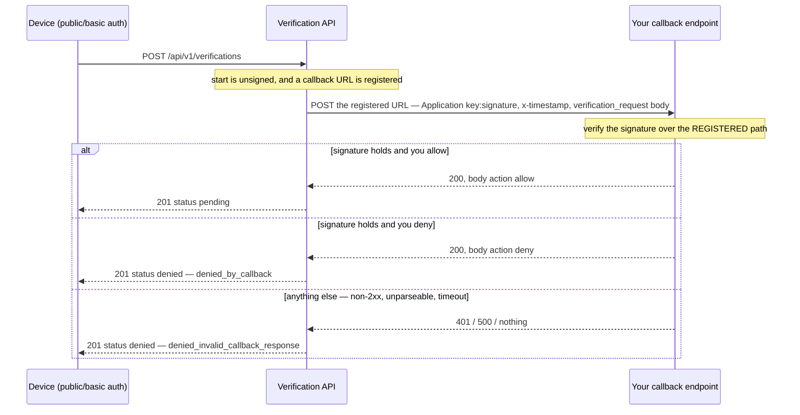

# The inbound callback

When a device starts a verification with `public` or `basic` auth, the API does not create it. It
first calls back to the URL registered on the application and asks whether to proceed. Your answer
decides that verification, once. Until this endpoint answers correctly, **every** such verification
is denied — with no error on the device beyond a `denied` status, and nothing in the SDK that can
tell you why.

Everything in this document is a way to deny 100% of your verifications while both sides hold a
valid signature. That is why it is a document and not a paragraph in a README.

`@didww/verification-node` implements the receiving side: `CallbackVerifier` for the
authentication, `expressCallbackHandler` for the whole route.

## When the API calls

| Start authenticated as | Callback URL registered | What happens                                                |
| ---------------------- | ----------------------- | ----------------------------------------------------------- |
| `application` (signed) | either                  | no callback — a signed caller is already trusted            |
| `basic`                | yes                     | callback sent                                               |
| `basic`                | no                      | proceeds without a callback                                 |
| `public`               | yes                     | callback sent                                               |
| `public`               | no                      | created `denied`, `denied_missing_callback_url`, no request |

A `public` start is authorized by nothing but this callback — the application key it carries is an
identifier, not a secret. That is the whole reason the endpoint exists.

## The flow



The API waits for your answer before the verification is created, so the device sees the outcome of
your decision in the response to its own start request.

## The request

```
POST <registered callback URL>
Content-Type: application/json
Authorization: Application <key>:<signature>
x-timestamp: <unix epoch seconds>

{"event":"verification_request","data":{"id":"…","destination":"…","delivery_method":"sms"}}
```

`destination` arrives as digits with no `+`. `delivery_method` is `sms` or `callout` for the
channels this release models; any other value passes through as the string received rather than
failing the parse.

## The signed path, and the empty string

**The signature covers the path of the _registered_ callback URL, not the path the request arrives
on.** The API signs the path component of the URL registered on the application, query excluded.

| Registered callback URL        | Signed path                          |
| ------------------------------ | ------------------------------------ |
| `https://example.com/cb/didww` | `/cb/didww`                          |
| `https://example.com`          | `''` — the empty string, **not** `/` |
| `https://example.com?x=1`      | `''` — query excluded                |

A bare origin has no path component, so the fifth line of the string to sign is empty. A receiver
that verifies against the pathname it was called on computes a valid signature over `/`, the sender
computed a valid signature over `''`, and the two never match. The symptom is a permanent
`signature_mismatch` and a 100% denial rate for that application, with correct-looking code and
correct-looking secrets on both sides. The working configuration value is `''`, and nobody guesses
it.

The same divergence appears whenever a proxy or ingress rewrites the path before your server sees
it. That is the second reason the path is never read off the request.

```ts
expressCallbackHandler({
  secret: (key) => secrets.get(key) ?? null,
  path: '', // registered at https://example.com — a bare origin
  decide: () => ({ action: 'allow' }),
});
```

### `path: 'incoming'`

Passing the literal `'incoming'` uses the received pathname instead, and is the only mode that tries
a second candidate: `/` and `''` are tried in turn, because they describe the same registered URL.
The fallback runs only on `signature_mismatch`, and `onRejected` never sees the first failure — a
bare-origin endpoint would otherwise log a rejection for every accepted callback.

An explicit `path` is never second-guessed. A wrong explicit value still fails, deliberately: a
verifier that quietly tries alternatives is a verifier whose configuration nobody ever fixes.

## The string to sign

HMAC-SHA256, base64-encoded. The HMAC key is the **URL-safe-base64 decode** of the application
secret — the raw bytes, never the secret's characters. The string is exactly five lines joined with
`\n`, with no trailing newline:

```
<HTTP-METHOD>
<CONTENT-MD5>
<CONTENT-TYPE>
x-timestamp:<TIMESTAMP>
<PATH>
```

- `CONTENT-MD5` — base64 of the MD5 of the body bytes; empty when the body is absent or empty. An
  inbound callback always carries a body, so this line is always populated here.
- `CONTENT-TYPE` — the exact header value received, and **empty when no header was sent**. A
  bodyless request must send no `Content-Type` header at all and sign the empty string on that
  line. This does not arise on the inbound callback, which is always `application/json`; it matters
  for the outbound direction and for anything else built on the exported `Signer`, where a
  transport that helpfully defaults a content type on every request 401s every signed `GET`. A test
  that runs a client against its own signer cannot see it — the two agree while both disagree with
  the server.
- `<PATH>` — as above, the registered URL's path, undecoded, query excluded.
- `x-timestamp` — Unix epoch **seconds**, the same value in the header and on the fourth line,
  accepted **within 300 seconds either way** (inclusive; `tolerance` overrides it). `CallbackVerifier`
  signs the received string verbatim rather than a number it re-renders, so a sender that pads or
  formats the value still verifies.

`Signer#stringToSign` is public so a production mismatch can be diffed against the server line by
line.

## Rejection

`CallbackVerifier.verify` returns `{ ok: false, reason, key }`. The order is fixed, and each
position is deliberate: size first, because it is the only unauthenticated-input surface and nothing
should be hashed before it passes; the body parsed last, only once the signature holds, so an
attacker's garbage body reports `signature_mismatch` rather than sending an operator to debug a JSON
error.

| Reason                    | Status | Means                                                      |
| ------------------------- | ------ | ---------------------------------------------------------- |
| `body_too_large`          | 400    | over `maxBodyBytes` (8192 by default)                      |
| `missing_signature`       | 401    | no `Authorization`, or not `Application <key>:<signature>` |
| `missing_timestamp`       | 401    | no `x-timestamp`, or blank                                 |
| `timestamp_out_of_window` | 401    | outside the tolerance, or not Unix seconds                 |
| `unknown_key`             | 401    | the resolver returned `null` for that key                  |
| `signature_mismatch`      | 401    | the HMAC differs — most often the path                     |
| `unparseable_body`        | 400    | signature held, envelope malformed                         |

`maxBodyBytes` is the SDK's own bound on unauthenticated work and mirrors no server-side limit. The
API's own 8192-byte cap, below, applies to the answer it reads back from you. The two happen to
share a default; raising one does nothing to the other.

**The reason is never echoed in the response body.** The adapter answers a bare status.
`unknown_key` is decided _before_ the signature is checked — it has to be, since the key selects the
secret — so a body distinguishing it from `signature_mismatch` would turn the endpoint into an
oracle for which application keys exist, answering an unauthenticated caller. Use `onRejected` to
log it on your side:

```ts
onRejected: (reason, req) => logger.warn({ reason, url: req.originalUrl }, 'callback rejected');
```

A comparison detail that matters if you write your own verifier: signatures are compared as raw
base64 ASCII in constant time, never by decoding both sides. The base64 decoder ignores padding,
whitespace and the unused low bits of the final character, so distinct garbage strings decode to
identical bytes and a decoding comparison accepts signatures it must reject.

## Your answer decides the verification, once

There is **no retry**. One request, one answer.

| Your answer                                                                | Outcome                                              |
| -------------------------------------------------------------------------- | ---------------------------------------------------- |
| `2xx` carrying `{"action":"allow"}`                                        | proceeds, `pending`                                  |
| `2xx` carrying `{"action":"deny"}`                                         | created `denied`, `denied_by_callback`               |
| any non-2xx, whatever the body                                             | created `denied`, `denied_invalid_callback_response` |
| a 2xx body that is not JSON, or whose `action` is neither value, or absent | created `denied`, `denied_invalid_callback_response` |
| a response over 8192 bytes, whatever its status                            | created `denied`, `denied_invalid_callback_response` |
| a connection failure or a timeout                                          | created `denied`, `denied_invalid_callback_response` |

Returning 401 does not make the API try again — it denies the verification. An empty `200` is not
an allow; the decision travels in the body.

`expressCallbackHandler` catches its own errors and hands them to `next`, so it behaves identically
on express 4 and express 5. Express 4 does not catch a rejected async handler: without this the
route would answer nothing at all, the request would hang until the API's read timeout, and the
verification would be denied silently.

## `express.raw({ type: '*/*' })` is required

Mount it on the callback route, and only on that route:

```ts
app.post('/callbacks/didww', express.raw({ type: '*/*' }), handler);
```

The signature covers the bytes that arrived. A body re-serialized by `express.json()` is a different
byte string — key order, whitespace, number formatting — and hashes to something else. `type: '*/*'`
rather than `type: 'application/json'` so a request whose content type is not what you expected
still reaches the handler as bytes rather than as `{}`.

The adapter does not guess: given anything other than a `Buffer` or a string it throws a
`ConfigurationError` through `next`, naming the fix. That is a loud failure — but only once the
first callback arrives, which is why it belongs in a checklist and not only in a stack trace.

## Several applications on one endpoint

`secret` takes a resolver as well as a fixed string. The key arrives in the `Authorization` header
of each callback:

```ts
expressCallbackHandler({
  secret: (key) => secrets.get(key) ?? null,
  path: '/callbacks/didww',
  decide: (payload) => ({ action: allowed(payload.data.destination) ? 'allow' : 'deny' }),
});
```

Returning `null` is what makes a key unknown. Returning a **blank** secret is not: a blank string is
a misconfigured store, and `Signer` throws for it rather than answering 401 to a legitimate
application forever. A fixed `secret` string is decoded at construction, so a malformed one fails at
wiring rather than on the first callback.

## Testing it

`examples/mock-api` issues real signed callbacks over a real socket, so a receiver can be tested
end to end with no credentials and no publicly reachable URL. Two of its seeded applications carry
callback URLs, and `app_public_bare_origin` is registered at a bare origin precisely so the
empty-string case is exercisable.

```sh
# terminal 1 — the API, calling back to your server
PORT=4000 CALLBACK_BASE_URL=http://127.0.0.1:3300 npm start --prefix examples/mock-api

# terminal 2 — a receiver; the route must be the path that is registered
PORT=3300 CALLBACK_ROUTE=/callbacks/verification npm start --prefix examples/node-server
```

```sh
# playing the device: a public start goes straight to the API
curl -sS -X POST http://127.0.0.1:4000/api/v1/verifications \
  -H 'content-type: application/json' \
  -H 'authorization: Application app_public_callback' \
  -d '{"data":{"destination":"+12025550143","delivery_method":"sms"}}'
```

`"status":"pending"` means your endpoint answered `allow` with a signature the API accepted.
`"status":"denied"` with `denied_invalid_callback_response` means it did not answer usefully —
check `onRejected`. `examples/node-server/README.md` walks the same run in more detail, including
the deny path.

In-process, `scripts/callback-roundtrip-oracle.test.mjs` is the pattern to copy for your own tests.
It matters because every unit test of the verifier signs its fixtures with the same `Signer` the
verifier checks them with, which proves the two agree and nothing more; the oracle has an
independent implementation send real callbacks and judges them. Its four cases are the four worth
having: a registered path accepted, a bare origin accepted against `''`, the same bare-origin
callback **rejected** when the receiver verifies `/` instead, and a wrong secret rejected. Without
the third, the first two could mean the verifier accepts anything.
